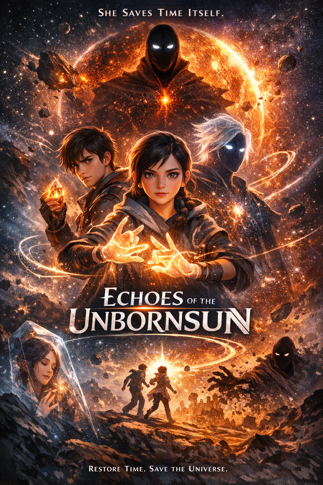

<p align="center">
  
</p>

<h1 align="center">ECHOES OF THE UNBORN SUN</h1>

<p align="center">
  <em>An Original Animated Feature</em><br><br>
  <strong>What if time was something you could hold in your hand — and someone was stealing all of it?</strong>
</p>

<p align="center">
  
  
  
</p>

---

## The Premise

In a universe where **time is a glowing mineral** buried underground, civilizations mine it, trade it, and burn it to survive. But every crystal burned **destroys a real moment forever** — a first kiss, a child's laugh, gone.

The mines are running out. Whole regions of space are turning into **nothing**. And at the center of it all is a dead star that was never destroyed — it was *silenced*.

One girl might be the only one who can restart it.

**She's 14. She's deaf. And that's exactly why she's the only hope.**

---

## Meet the World

| | |
|---|---|
| A planet where **sound never existed** | Forests that glow instead of sing |
| A star-god with a **galaxy in their chest** | A thief who can **jump through time** |
| A villain who can **erase anything he's heard** | A mother frozen in crystal, lighting the way |

> *"He can erase anything from existence — but he's never heard her voice. Because she's never had one."*

---

## Characters

<details>
<summary><strong>LYRA VOSS</strong> — The Girl Who Signs in Light</summary>
<br>
14 years old. Deaf. Lives on a planet where all life communicates through light and color. Her sign language leaves trails of light in the air. She can feel time itself vibrating — a frequency only she can sense.

Her mother disappeared into the mines. Everyone says she's dead.

Lyra doesn't buy it.
</details>

<details>
<summary><strong>SOLACE</strong> — The Dying Star</summary>
<br>
The last child of the First Sun. A star walking in a teenager's body, with a galaxy slowly spinning inside their chest. Stars inside them are going out one by one.

Ancient. Gentle. Terrified of the dark.

Running out of time.
</details>

<details>
<summary><strong>KAEL</strong> — The Boy Who Skips Through Seconds</summary>
<br>
17-year-old thief who can jump 2 seconds forward or backward through time. Impossible to catch.

Joined for the money. Stays because — for the first time — he has friends.
</details>

<details>
<summary><strong>THE SILENCE</strong> — The One Who Erases</summary>
<br>
A man made of erased time. Point at a mountain — it was never there. Point at a person — they were never born.

His robes are frozen moments of people laughing, crying, screaming — all stuck on loop. His face is a void.

He wants to erase everything. He thinks he's being kind.

But he has one weakness...

<blockquote><em>He can only erase what he's heard.</em></blockquote>
</details>

<details>
<summary><strong>???</strong> — The Hidden Character</summary>
<br>

🔒 <em>This character's identity is part of the story's biggest reveal. Access the full story bible to find out.</em>
</details>

---

## Why This Has Never Been Done

- A **deaf protagonist** who saves the universe *because* of her deafness — not despite it
- **Sign language animated as trails of light** — the most beautiful language ever put on screen
- Scenes from her perspective have **zero sound** — the audience *feels* her world
- A villain who literally **cannot touch her** because his power doesn't work on silence

---

## The Story

<details>
<summary><strong>Click to reveal a tiny hint...</strong></summary>
<br>

She finds a message from someone who was supposed to be dead.

A star is dying.

Time is running out — literally.

And in the end, she puts her hands on the heart of the universe and does the one thing no one expected.

<em>She talks to it.</em>

<blockquote><strong>What happens next is in the full story bible.</strong></blockquote>
</details>

---

## What's Inside

| File | Contents |
|---|---|
| `poster.png` | Official trailer poster image |
| `Echoes_of_the_Unborn_Sun.rar` | Full story bible, character images & reference art *(password protected)* |

> **Password hint:** The name of Lyra's home planet. *(It's somewhere on this page.)*

---

## The Vibe

```
Spider-Verse  ×  Studio Ghibli  ×  Interstellar
```

Painterly 2D characters. Volumetric 3D worlds. A dead sun waiting to be reborn.

---

## Interested?

This project is actively seeking a **co-production partner** for development.

Full pitch bible, character designs, and visual references available on request.

<p align="center">
  <br>
  <strong>📧 davejenkins1030@gmail.com</strong><br>
  <br>
  <em>"The universe began with a word no one heard.<br>Maybe it's time someone signed it."</em>
</p>

---

<p align="center">
  <sub>© 2026 [YOUR NAME] — All Rights Reserved. Confidential materials enclosed.</sub>
</p>
